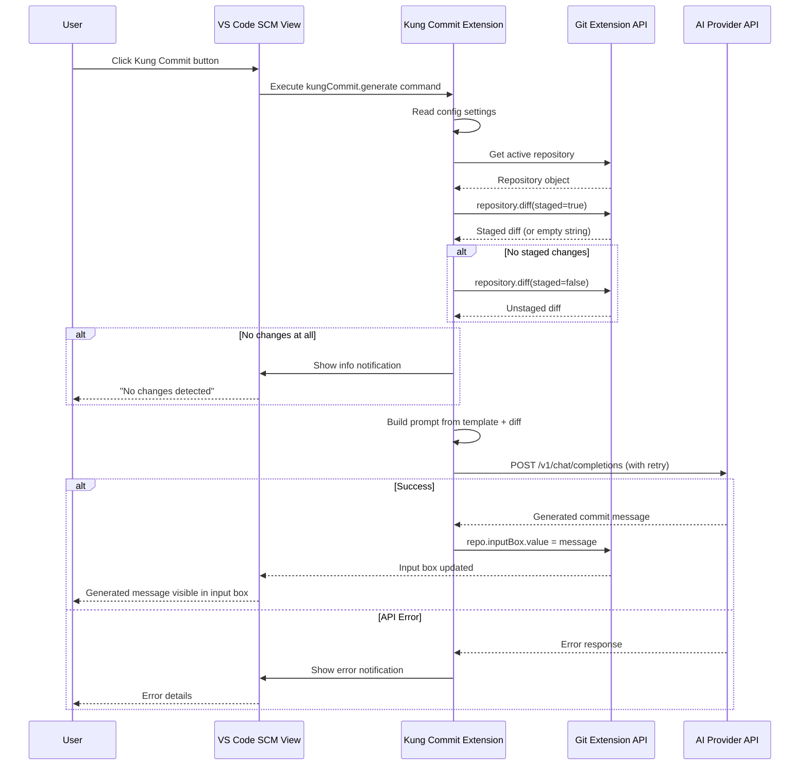
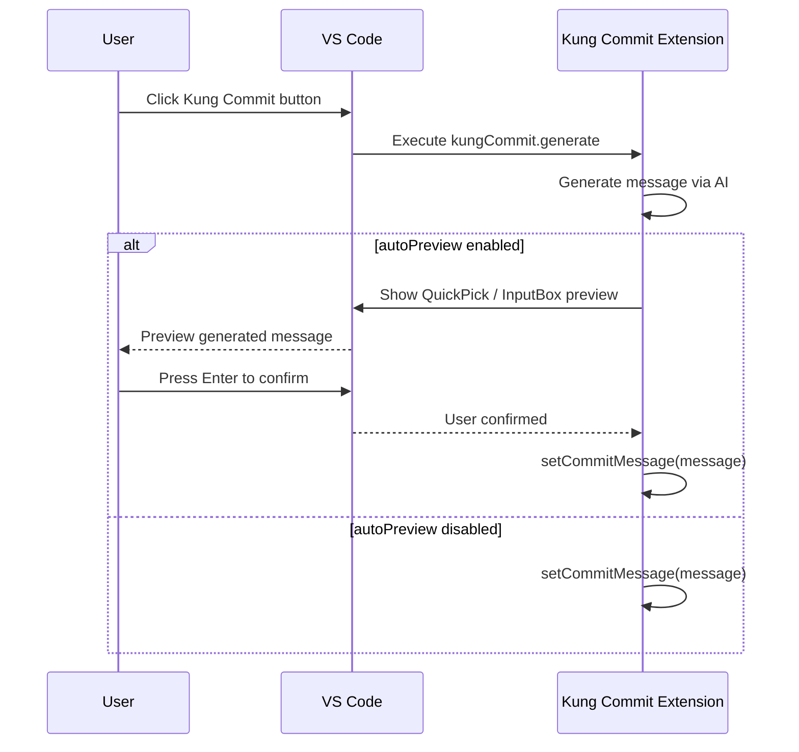

# Kung Commit — VS Code Extension Architecture Plan

> **Extension Name**: `kung-commit`
> **Purpose**: Add a clickable button to the Source Control panel's commit message toolbar that generates a commit message from `git diff` using an LLM (AI provider).

---

## Table of Contents

1. [Project Structure](#1-project-structure)
2. [Extension Entry Point](#2-extension-entry-point-extensionts)
3. [Source Control Integration](#3-source-control-integration)
4. [Git Diff Extraction](#4-git-diff-extraction)
5. [AI Integration](#5-ai-integration)
6. [Commit Message Insertion](#6-commit-message-insertion)
7. [Configuration](#7-configuration)
8. [Build & Packaging](#8-build--packaging)
9. [Data Flow Diagram](#9-data-flow-diagram)
10. [Implementation Order](#10-implementation-order)

---

## 1. Project Structure

```
kung-commit/
├── .vscode/
│   ├── launch.json              # Debug config for extension
│   ├── tasks.json               # Build tasks
│   └── settings.json            # Workspace settings
├── src/
│   ├── extension.ts             # Extension activation/deactivation
│   ├── commands/
│   │   └── generateCommit.ts    # Command handler for AI commit generation
│   ├── git/
│   │   ├── diffExtractor.ts     # Extract staged/unstaged diffs
│   │   └── repository.ts        # Discover and access Git repositories
│   ├── ai/
│   │   ├── provider.ts          # AI provider interface & types
│   │   ├── openaiProvider.ts    # OpenAI implementation
│   │   ├── anthropicProvider.ts # Anthropic implementation
│   │   ├── customProvider.ts    # Custom endpoint implementation
│   │   └── factory.ts           # Provider factory (select by config)
│   ├── scm/
│   │   └── inputBox.ts          # SCM input box integration
│   ├── config/
│   │   └── settings.ts          # VS Code settings reader
│   ├── utils/
│   │   ├── retry.ts             # Exponential backoff retry utility
│   │   └── errors.ts            # Custom error types
│   └── test/
│       ├── suite/
│       │   ├── extension.test.ts
│       │   ├── diffExtractor.test.ts
│       │   └── aiProvider.test.ts
│       └── runTest.ts
├── package.json                 # Manifest: activation, contributes, menus
├── tsconfig.json                # TypeScript configuration
├── esbuild.config.mjs           # esbuild config for bundling
├── .vscodeignore                # Files excluded from VSIX package
├── README.md                    # Extension documentation
├── CHANGELOG.md                 # Version history
└── LICENSE                      # MIT license
```

### Rationale

| Directory / File | Purpose |
|---|---|
| `src/extension.ts` | Standard VS Code entry point; registers commands and subscriptions |
| `src/commands/` | Isolates command logic from activation — easy to test and add new commands |
| `src/git/` | Wraps all Git interaction behind a clean interface; swap strategy without changing callers |
| `src/ai/` | Provider pattern — one interface, multiple backends (OpenAI, Anthropic, custom) |
| `src/scm/` | Dedicated module for SCM view integration (reading/setting the input box) |
| `src/config/` | Centralized typed access to `vscode.workspace.getConfiguration` |
| `src/utils/` | Generic helpers (retry logic, error types) reusable across modules |

---

## 2. Extension Entry Point (`extension.ts`)

### Activation Events

```jsonc
// package.json
"activationEvents": [
  "onCommand:kungCommit.generate",
  "onView:scm"                         // Activate when SCM view is visible
]
```

`onView:scm` ensures the extension activates as soon as the Source Control panel opens, so the button is available immediately. `onCommand:kungCommit.generate` is a fallback activation if the command is triggered programmatically.

### Registration Flow

```
extension.activate(context)
├── 1. Register `kungCommit.generate` command
│     └── handler: generateCommitMessage()
├── 2. Register config change listener
│     └── vscode.workspace.onDidChangeConfiguration → invalidate provider cache
├── 3. Push all disposables into context.subscriptions
└── 4. Log successful activation
```

```typescript
// Pseudocode for extension.ts
import * as vscode from 'vscode';
import { generateCommitMessage } from './commands/generateCommit';

export function activate(context: vscode.ExtensionContext) {
  const disposable = vscode.commands.registerCommand(
    'kungCommit.generate',
    () => generateCommitMessage()
  );
  context.subscriptions.push(disposable);

  // Re-create provider when settings change
  context.subscriptions.push(
    vscode.workspace.onDidChangeConfiguration(e => {
      if (e.affectsConfiguration('kungCommit')) {
        // Invalidate cached provider instance
      }
    })
  );

  console.log('Kung Commit extension activated');
}
```

### Deactivation

No special cleanup is required; VS Code disposes of registered subscriptions automatically. If there are in-flight API requests, they should be aborted via `AbortController`.

---

## 3. Source Control Integration

### 3.1 Menu Contribution (`package.json`)

The button is added to the SCM title toolbar via the `scm/title` menu contribution point:

```jsonc
// package.json → contributes
{
  "contributes": {
    "commands": [
      {
        "command": "kungCommit.generate",
        "title": "Generate Commit Message with AI",
        "icon": "$(sparkle)"                          // VS Code built-in icon
      }
    ],
    "menus": {
      "scm/title": [
        {
          "command": "kungCommit.generate",
          "group": "navigation",                      // Places button inline in toolbar
          "when": "scmProvider == git"                 // Only show for Git SCM
        }
      ]
    }
  }
}
```

**Why `scm/title`?**  
- `scm/title` adds buttons to the toolbar above the commit message input box — exactly where the user wants it.
- The `"group": "navigation"` places it in the primary toolbar row (not in the overflow menu).
- The `"when": "scmProvider == git"` context key ensures the button only appears when the active SCM provider is Git.

### 3.2 Icon

VS Code provides built-in icons via `$(iconName)` syntax. Recommended:
- `$(sparkle)` — conventional commit generation
- `$(wand)` — magic/assist theme

Custom SVG icons can be used instead by setting `icon` to a relative path to a `.svg` file in the extension. The plan uses `$(sparkle)` for simplicity.

### 3.3 Context Key `scmProvider`

The `scmProvider` context key is automatically set by VS Code's SCM system to the `id` of the active source control provider. The built-in Git extension registers with `id: "git"`, so `scmProvider == git` correctly scopes the button to Git repositories.

---

## 4. Git Diff Extraction

### 4.1 Strategy: Dual Approach

| Approach | Mechanism | When Used |
|---|---|---|
| **Primary** | Built-in Git extension API (`vscode.git`) | Preferred — no subprocess overhead, respects VS Code's Git config |
| **Fallback** | Spawn `git` process via `child_process` | If the Git extension API is unavailable or the repo isn't tracked by it |

### 4.2 Primary: Built-in Git Extension API

The built-in Git extension (`vscode.git`) exposes its API via `vscode.extensions.getExtension`. The API provides a `Repository` object with access to diffs.

```typescript
// Pseudocode for src/git/diffExtractor.ts

import * as vscode from 'vscode';
import { API as GitAPI, Repository } from './gitExtensionTypes';

interface GitExtension {
  getAPI(version: number): GitAPI;
}

export async function getDiff(): Promise<string> {
  const gitExt = vscode.extensions.getExtension<GitExtension>('vscode.git');
  if (!gitExt?.isActive) {
    await gitExt?.activate();
  }

  const api = gitExt!.exports.getAPI(1);
  const repository = api.repositories[0];       // Active repository
  if (!repository) {
    throw new Error('No Git repository found');
  }

  // 1. Try staged diff first
  let diff = await repository.diff(true);        // true = staged
  if (diff.trim().length === 0) {
    // 2. Fall back to unstaged diff
    diff = await repository.diff(false);         // false = unstaged
  }

  if (diff.trim().length === 0) {
    throw new Error('No changes detected in the repository');
  }

  return diff;
}
```

**Important**: The `vscode.git` extension's API types are not published on npm. The extension must:
1. Declare the Git extension as an `extensionDependency` in `package.json`
2. Ship a local type declaration file (`src/git/gitExtensionTypes.d.ts`) that describes the relevant subset of the Git extension API

```jsonc
// package.json
{
  "extensionDependencies": [
    "vscode.git"
  ]
}
```

### 4.3 Fallback: Spawning `git` Process

If the Git extension API is not available:

```typescript
// Pseudocode for spawning git
import { exec } from 'child_process';
import { promisify } from 'util';

const execAsync = promisify(exec);

export async function getGitDiff(cwd: string): Promise<string> {
  // Try staged first
  const { stdout: staged } = await execAsync('git diff --staged', { cwd });
  if (staged.trim().length > 0) return staged;

  // Fall back to unstaged
  const { stdout: unstaged } = await execAsync('git diff', { cwd });
  if (unstaged.trim().length > 0) return unstaged;

  throw new Error('No changes detected');
}
```

### 4.4 Git Extension Type Declarations

Create a minimal type declaration file:

```
src/git/gitExtensionTypes.d.ts
```

```typescript
// Minimal type declarations for vscode.git extension API
export interface Repository {
  diff(staged: boolean): Promise<string>;
  rootUri: vscode.Uri;
  inputBox: vscode.SourceControlInputBox;
}

export interface API {
  repositories: Repository[];
  getRepository(uri: vscode.Uri): Repository | undefined;
}
```

Only declare what our extension actually uses to minimize maintenance burden when `vscode.git` updates.

---

## 5. AI Integration

### 5.1 Provider Interface

```typescript
// src/ai/provider.ts

export interface AiProviderConfig {
  apiKey: string;
  model: string;
  endpoint?: string;          // Custom endpoint URL
  maxTokens?: number;
  temperature?: number;
}

export interface AiProvider {
  readonly name: string;
  generateCommitMessage(diff: string, promptTemplate: string): Promise<string>;
}
```

### 5.2 Provider Implementations

#### OpenAI Provider (`src/ai/openaiProvider.ts`)

- **Endpoint**: `https://api.openai.com/v1/chat/completions`
- **Model**: Default `gpt-4o-mini` (configurable)
- **Auth**: Bearer token via `Authorization` header
- **Request body**:
  ```json
  {
    "model": "gpt-4o-mini",
    "messages": [
      { "role": "system", "content": "You are a helpful assistant..." },
      { "role": "user", "content": "<prompt_template>\n\nDiff:\n<diff_content>" }
    ],
    "temperature": 0.3,
    "max_tokens": 300
  }
  ```

#### Anthropic Provider (`src/ai/anthropicProvider.ts`)

- **Endpoint**: `https://api.anthropic.com/v1/messages`
- **Model**: Default `claude-sonnet-4-20250514` (configurable)
- **Auth**: `x-api-key` header
- **API version header**: `anthropic-version: 2023-06-01`
- **Request body** (Messages API):
  ```json
  {
    "model": "claude-sonnet-4-20250514",
    "max_tokens": 300,
    "messages": [
      { "role": "user", "content": "<prompt_template>\n\nDiff:\n<diff_content>" }
    ]
  }
  ```

#### Custom Provider (`src/ai/customProvider.ts`)

- Generic fetch-based implementation
- User configures `endpoint`, `apiKey`, `model`
- Supports custom `Authorization` header format (Bearer, x-api-key, etc.)
- Optionally configurable request/response field mapping via settings

### 5.3 Provider Factory

```typescript
// src/ai/factory.ts

import { AiProvider } from './provider';
import { OpenAIProvider } from './openaiProvider';
import { AnthropicProvider } from './anthropicProvider';
import { CustomProvider } from './customProvider';

export function createProvider(config: ExtensionConfig): AiProvider {
  switch (config.provider) {
    case 'openai':
      return new OpenAIProvider(config);
    case 'anthropic':
      return new AnthropicProvider(config);
    case 'custom':
      return new CustomProvider(config);
    default:
      throw new Error(`Unknown AI provider: ${config.provider}`);
  }
}
```

### 5.4 Retry & Error Handling (`src/utils/retry.ts`)

```typescript
export async function withRetry<T>(
  fn: () => Promise<T>,
  options: {
    maxRetries?: number;      // Default: 3
    baseDelay?: number;       // Default: 1000ms
    maxDelay?: number;        // Default: 10000ms
    retryOn?: (error: any) => boolean;  // Which errors trigger retry
  }
): Promise<T>
```

**Retry policy**:
- Retry on network errors, 429 (rate limit), 5xx (server errors)
- Do NOT retry on 4xx (auth errors, bad request) — surface those immediately
- Exponential backoff with jitter

### 5.5 Error Handling Flow

```
generateCommitMessage()
├── 1. Validate config (API key present, provider selected)
│     └── Missing config → show error notification
├── 2. Get diff via GitExtractor
│     └── No changes → show info notification, exit
├── 3. Build prompt from template + diff
├── 4. Call provider with retry
│     ├── Success → return message
│     ├── Rate limited → wait & retry (up to 3 times)
│     ├── Auth error → show error "Invalid API key"
│     └── Network error → show error "Check your connection"
└── 5. Return generated message
```

### 5.6 Prompt Template

Default template (configurable via `kungCommit.promptTemplate`):

```
You are an expert developer. Generate a concise conventional commit message
based on the following git diff. Use the format:

<type>(<scope>): <description>

Types: feat, fix, chore, docs, style, refactor, perf, test, ci, build, revert

Focus on the WHAT and WHY, not the HOW. Keep the description under 72 characters.
If there are multiple changes, use a short summary as the header and bullet points
for details.

Git Diff:
{diff}
```

The `{diff}` placeholder is replaced with the actual diff content at runtime.

---

## 6. Commit Message Insertion

### 6.1 Mechanism

After the AI returns the generated commit message, the extension sets the value of the SCM input box:

```typescript
// src/scm/inputBox.ts

import * as vscode from 'vscode';

export function setCommitMessage(message: string): void {
  // Preferred: Use SourceControl API if available
  const gitExt = vscode.extensions.getExtension('vscode.git');
  if (gitExt?.isActive) {
    const api = gitExt.exports.getAPI(1);
    const repo = api.repositories[0];
    if (repo?.inputBox) {
      repo.inputBox.value = message;
      repo.inputBox.valueSelection = [0, message.length]; // Select all
      return;
    }
  }

  // Fallback: Try to find SCM input box via vscode.scm API
  const scmProviders = vscode.scm.inputBox;
  // Note: vscode.scm.inputBox doesn't exist directly in the API.
  // The fallback is to use the Git repository's inputBox from the Git extension API.
}
```

> **Note**: The `vscode.scm` namespace provides `SourceControl` instances, each with an `inputBox` property. However, accessing the active Git repository's `inputBox` through the Git extension API is the most reliable approach.

### 6.2 Full Command Handler Flow

```typescript
// src/commands/generateCommit.ts

export async function generateCommitMessage(): Promise<void> {
  const config = readConfig();
  const diff = await getDiff();
  const prompt = buildPrompt(config.promptTemplate, diff);
  const provider = createProvider(config);
  const message = await withRetry(() => provider.generateCommitMessage(diff, config.promptTemplate));
  setCommitMessage(message);
}
```

---

## 7. Configuration

### 7.1 Settings Schema (`package.json` → `contributes.configuration`)

```jsonc
{
  "contributes": {
    "configuration": {
      "title": "Kung Commit",
      "properties": {
        "kungCommit.provider": {
          "type": "string",
          "default": "openai",
          "enum": ["openai", "anthropic", "custom"],
          "enumDescriptions": [
            "OpenAI (GPT-4, GPT-4o-mini, etc.)",
            "Anthropic (Claude)",
            "Custom endpoint (any OpenAI-compatible API)"
          ],
          "description": "AI provider to use for generating commit messages"
        },
        "kungCommit.apiKey": {
          "type": "string",
          "default": "",
          "markdownDescription": "API key for the AI provider. Can also be set via the `KUNG_COMMIT_API_KEY` environment variable."
        },
        "kungCommit.model": {
          "type": "string",
          "default": "",
          "markdownDescription": "Model name to use. If left empty, a sensible default for the chosen provider will be used (e.g., `gpt-4o-mini` for OpenAI, `claude-sonnet-4-20250514` for Anthropic)."
        },
        "kungCommit.endpoint": {
          "type": "string",
          "default": "",
          "markdownDescription": "Custom API endpoint URL. Only required when provider is `custom`. Must be a full URL including protocol (e.g., `https://api.openai.com/v1`)."
        },
        "kungCommit.customHeaders": {
          "type": "object",
          "default": {},
          "markdownDescription": "Additional HTTP headers for the custom endpoint (e.g., `{ \"x-api-key\": \"...\" }`). Only used with the `custom` provider.",
          "additionalProperties": {
            "type": "string"
          }
        },
        "kungCommit.promptTemplate": {
          "type": "string",
          "default": "<default prompt text>",
          "markdownDescription": "Custom prompt template sent to the AI. Use `{diff}` as a placeholder for the git diff content. Default produces conventional commit messages."
        },
        "kungCommit.autoPreview": {
          "type": "boolean",
          "default": false,
          "description": "Automatically show a preview of the generated message before inserting it into the commit input box"
        },
        "kungCommit.temperature": {
          "type": "number",
          "default": 0.3,
          "minimum": 0,
          "maximum": 2,
          "description": "Creativity of the AI response (0 = deterministic, 2 = very creative)"
        },
        "kungCommit.maxTokens": {
          "type": "number",
          "default": 300,
          "minimum": 50,
          "maximum": 2000,
          "description": "Maximum tokens in the generated commit message"
        }
      }
    }
  }
}
```

### 7.2 API Key Security

- The `kungCommit.apiKey` setting uses VS Code's built-in secret storage via the `machine-overridable` scope, but for the simplest approach it's stored in user settings.
- **Alternative**: Read from environment variable `KUNG_COMMIT_API_KEY` as a fallback. This allows users to set the key globally without putting it in VS Code settings.
- **Future enhancement**: Use `vscode.SecretStorage` API (`context.secrets`) for encrypted storage.

### 7.3 Settings Reader (`src/config/settings.ts`)

```typescript
// Reads all kungCommit.* settings into a typed object
export interface ExtensionConfig {
  provider: 'openai' | 'anthropic' | 'custom';
  apiKey: string;
  model: string;
  endpoint: string;
  customHeaders: Record<string, string>;
  promptTemplate: string;
  autoPreview: boolean;
  temperature: number;
  maxTokens: number;
}

export function readConfig(): ExtensionConfig {
  const cfg = vscode.workspace.getConfiguration('kungCommit');
  return {
    provider: cfg.get<'openai' | 'anthropic' | 'custom'>('provider', 'openai'),
    apiKey: cfg.get<string>('apiKey', '') || process.env.KUNG_COMMIT_API_KEY || '',
    model: cfg.get<string>('model', ''),
    endpoint: cfg.get<string>('endpoint', ''),
    customHeaders: cfg.get<Record<string, string>>('customHeaders', {}),
    promptTemplate: cfg.get<string>('promptTemplate', DEFAULT_PROMPT),
    autoPreview: cfg.get<boolean>('autoPreview', false),
    temperature: cfg.get<number>('temperature', 0.3),
    maxTokens: cfg.get<number>('maxTokens', 300),
  };
}
```

---

## 8. Build & Packaging

### 8.1 Build Toolchain

| Tool | Purpose |
|---|---|
| **TypeScript** (`tsc`) | Type-checking and type declarations |
| **esbuild** | Bundling extension into a single JS file for fast loading |
| **vsce** (`@vscode/vsce`) | Packaging into `.vsix` for distribution |

### 8.2 `esbuild.config.mjs`

```javascript
import * as esbuild from 'esbuild';

const config = {
  entryPoints: ['src/extension.ts'],
  bundle: true,
  outfile: 'dist/extension.js',
  external: ['vscode'],          // VS Code API is provided at runtime
  format: 'cjs',
  platform: 'node',              // VS Code extensions run on Node.js
  sourcemap: true,
  minify: false,
  target: ['node18'],
};

export default config;
```

### 8.3 `tsconfig.json`

```jsonc
{
  "compilerOptions": {
    "module": "commonjs",
    "target": "ES2022",
    "lib": ["ES2022"],
    "outDir": "dist",
    "rootDir": "src",
    "strict": true,
    "esModuleInterop": true,
    "skipLibCheck": true,
    "forceConsistentCasingInFileNames": true,
    "resolveJsonModule": true,
    "declaration": true,
    "sourceMap": true
  },
  "include": ["src/**/*"],
  "exclude": ["node_modules", "dist", ".vscode-test"]
}
```

### 8.4 Scripts (`package.json`)

```jsonc
{
  "scripts": {
    "vscode:prepublish": "npm run build",
    "build": "esbuild --config=esbuild.config.mjs",
    "watch": "esbuild --config=esbuild.config.mjs --watch",
    "lint": "eslint src --ext .ts",
    "test": "node ./out/test/runTest.js",
    "package": "vsce package"
  }
}
```

### 8.5 `.vscodeignore`

```
.vscode/**
src/**
node_modules/**
.eslintrc.json
tsconfig.json
esbuild.config.mjs
.gitignore
**/*.map
```

### 8.6 `package.json` — Full Manifest

```jsonc
{
  "name": "kung-commit",
  "displayName": "Kung Commit",
  "description": "Generate conventional commit messages from your staged changes using AI",
  "version": "0.1.0",
  "publisher": "your-publisher-id",
  "engines": {
    "vscode": "^1.85.0"
  },
  "categories": ["SCM Providers", "Other"],
  "keywords": ["git", "commit", "ai", "conventional-commit"],
  "activationEvents": [
    "onCommand:kungCommit.generate",
    "onView:scm"
  ],
  "extensionDependencies": [
    "vscode.git"
  ],
  "main": "./dist/extension.js",
  "contributes": {
    "commands": [
      {
        "command": "kungCommit.generate",
        "title": "Generate Commit Message with AI",
        "icon": "$(sparkle)"
      }
    ],
    "menus": {
      "scm/title": [
        {
          "command": "kungCommit.generate",
          "group": "navigation",
          "when": "scmProvider == git"
        }
      ]
    },
    "configuration": {
      "title": "Kung Commit",
      "properties": {
        // ... (see Section 7.1)
      }
    }
  }
}
```

---

## 9. Data Flow Diagram



### Alternative Flow (with Auto-Preview)



---

## 10. Implementation Order

Below is the recommended implementation sequence, structured as independent tasks that can be assigned to different developers.

### Phase 1: Scaffolding & Configuration

| Step | Description | Key Files |
|---|---|---|
| 1.1 | Initialize npm project, install dependencies (`@types/vscode`, `esbuild`, `vsce`, `typescript`) | `package.json`, `tsconfig.json` |
| 1.2 | Create `esbuild.config.mjs` and `.vscodeignore` | `esbuild.config.mjs`, `.vscodeignore` |
| 1.3 | Define `contributes.configuration` settings schema in `package.json` | `package.json` |
| 1.4 | Implement `src/config/settings.ts` — typed settings reader | `src/config/settings.ts` |
| 1.5 | Create basic `src/extension.ts` with activation, command registration, and config change listener | `src/extension.ts` |

### Phase 2: SCM Toolbar Button

| Step | Description | Key Files |
|---|---|---|
| 2.1 | Define `kungCommit.generate` command and `scm/title` menu contribution in `package.json` | `package.json` |
| 2.2 | Implement basic command handler that shows a placeholder notification | `src/commands/generateCommit.ts` |
| 2.3 | Verify the button appears in the SCM toolbar | Manual test |

### Phase 3: Git Diff Extraction

| Step | Description | Key Files |
|---|---|---|
| 3.1 | Create Git extension type declarations | `src/git/gitExtensionTypes.d.ts` |
| 3.2 | Implement `src/git/repository.ts` — discover active repository via Git extension API | `src/git/repository.ts` |
| 3.3 | Implement `src/git/diffExtractor.ts` — get staged/unstaged diff | `src/git/diffExtractor.ts` |
| 3.4 | Add fallback using `child_process.exec` for spawning `git` directly | `src/git/diffExtractor.ts` |

### Phase 4: AI Provider System

| Step | Description | Key Files |
|---|---|---|
| 4.1 | Define `AiProvider` interface and types | `src/ai/provider.ts` |
| 4.2 | Implement `withRetry` utility | `src/utils/retry.ts` |
| 4.3 | Implement OpenAI provider | `src/ai/openaiProvider.ts` |
| 4.4 | Implement Anthropic provider | `src/ai/anthropicProvider.ts` |
| 4.5 | Implement Custom provider (generic fetch) | `src/ai/customProvider.ts` |
| 4.6 | Implement provider factory | `src/ai/factory.ts` |
| 4.7 | Implement error types and messages | `src/utils/errors.ts` |

### Phase 5: Commit Message Insertion & Full Flow

| Step | Description | Key Files |
|---|---|---|
| 5.1 | Implement `src/scm/inputBox.ts` — set commit message via Git extension API inputBox | `src/scm/inputBox.ts` |
| 5.2 | Wire up the full command handler: read config → get diff → generate → insert | `src/commands/generateCommit.ts` |
| 5.3 | Implement auto-preview feature (QuickPick or InputBox confirmation) | `src/commands/generateCommit.ts` |

### Phase 6: Testing & Polish

| Step | Description | Key Files |
|---|---|---|
| 6.1 | Write unit tests for diff extraction (mock Git extension API) | `src/test/suite/diffExtractor.test.ts` |
| 6.2 | Write unit tests for AI provider (mock HTTP fetch) | `src/test/suite/aiProvider.test.ts` |
| 6.3 | Write integration test for full command flow | `src/test/suite/extension.test.ts` |
| 6.4 | Manual testing: staged changes, unstaged changes, no changes, API errors | — |
| 6.5 | Update `README.md` with usage instructions and configuration reference | `README.md` |

---

## Appendix: Key VS Code API References

| API | Usage |
|---|---|
| `vscode.commands.registerCommand` | Register the `aiCommit.generate` command |
| `vscode.extensions.getExtension` | Access the built-in Git extension API |
| `vscode.workspace.getConfiguration` | Read `aiCommit.*` settings |
| `vscode.workspace.onDidChangeConfiguration` | React to config changes |
| `vscode.window.showInformationMessage` | Notify user (no changes, success) |
| `vscode.window.showErrorMessage` | Notify user (errors) |
| `vscode.window.showInputBox` | Optional auto-preview confirmation |
| `vscode.SourceControlInputBox` | The commit message input box (via Git extension repo) |
| `scm/title` menu contribution | Add button to SCM toolbar |
| `scmProvider` context key | Conditionally show button for Git only |

---

## Appendix: Dependencies (`package.json`)

```jsonc
{
  "devDependencies": {
    "@types/vscode": "^1.85.0",
    "@types/node": "^20.x",
    "typescript": "^5.4.0",
    "esbuild": "^0.20.0",
    "@vscode/vsce": "^2.24.0",
    "eslint": "^8.56.0",
    "@typescript-eslint/eslint-plugin": "^7.0.0",
    "@typescript-eslint/parser": "^7.0.0",
    "@vscode/test-electron": "^2.3.8"
  },
  "dependencies": {}
}
```

No runtime dependencies are needed — all AI provider calls use Node.js built-in `fetch` (available since Node 18) or the `https` module. This keeps the extension lightweight and avoids security review overhead from third-party packages.

---

> **End of Architecture Plan**
