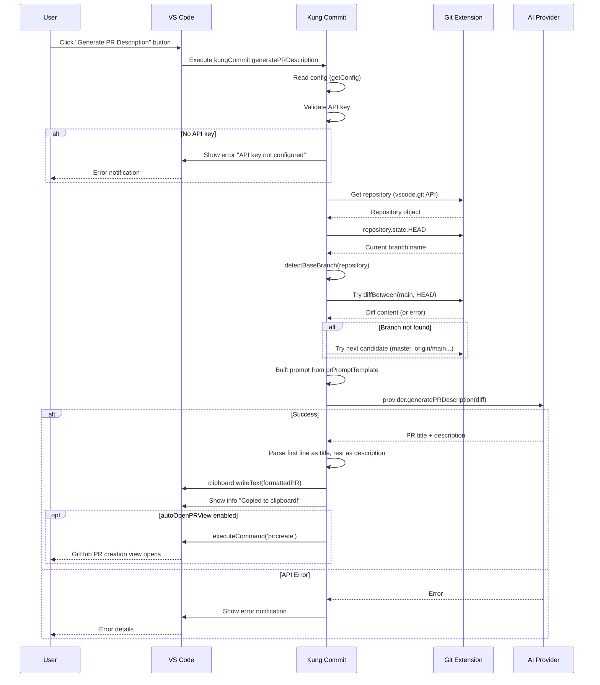
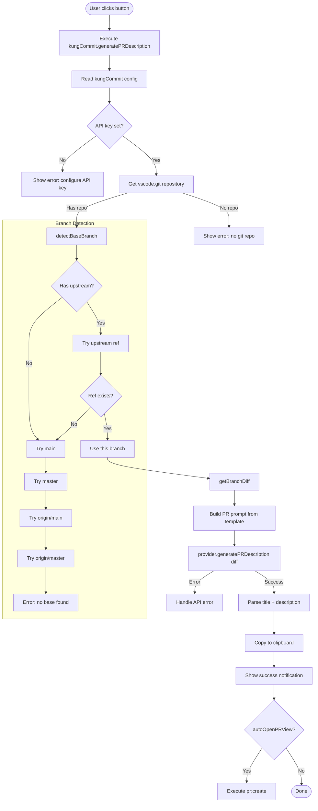

# PR Title & Description Generation — Architecture Plan

> **Feature**: Extend the Kung Commit VS Code extension to generate PR titles and descriptions from branch diffs.
> **Status**: Proposed
> **Base Branch**: `main` / `master` (auto-detected)

---

## Table of Contents

1. [Overview](#1-overview)
2. [Branch Detection Strategy](#2-branch-detection-strategy)
3. [Git Extension API Types](#3-git-extension-api-types)
4. [AI Provider Changes](#4-ai-provider-changes)
5. [Prompt Template Design](#5-prompt-template-design)
6. [Command Handler Flow](#6-command-handler-flow)
7. [UI/UX Considerations](#7-uiux-considerations)
8. [Configuration](#8-configuration)
9. [File-by-File Changes](#9-file-by-file-changes)
10. [Data Flow Diagram](#10-data-flow-diagram)
11. [Error Handling Matrix](#11-error-handling-matrix)
12. [Implementation Order](#12-implementation-order)

---

## 1. Overview

### Problem

The extension currently generates commit messages from staged/unstaged diffs. Users need to manually write PR titles and descriptions when creating pull requests, which is repetitive and inconsistent.

### Solution

Add a `kungCommit.generatePRDescription` command that:
1. Detects the current feature branch and the base branch (`main`/`master`)
2. Gets the diff between the base branch and current HEAD using the built-in Git extension's [`Repository.diffBetween()`](src/gitExtensionTypes.d.ts:9) API
3. Sends the diff to the configured AI provider with a PR-specific prompt
4. Copies the formatted result (title + description body) to the clipboard
5. Optionally opens the GitHub PR creation view

### What's NOT Changing

- Existing commit message generation flow remains untouched
- The `AIProvider` interface gains a new method but existing ones stay
- No new external dependencies are introduced
- The esbuild bundling setup remains the same

---

## 2. Branch Detection Strategy

### Algorithm

The base branch detection follows a priority-based fallback chain:

```
detectBaseBranch(repository):
  1. Read repository.state.HEAD  → current branch name
  2. Read repository.state.upstream → upstream tracking ref (e.g., "refs/remotes/origin/main")
  3. If upstream exists:
     a. Extract remote branch name (e.g., "origin/main")
     b. Try diffBetween("origin/main", HEAD) — if succeeds, use "origin/main"
  4. If no upstream or it fails, try in order:
     a. "main"           — local branch
     b. "master"         — local branch
     c. "origin/main"    — remote-tracking branch
     d. "origin/master"  — remote-tracking branch
  5. First branch that exists and returns a non-empty diff wins
  6. If none succeed → throw "Could not determine base branch"
```

### Implementation in [`src/gitDiff.ts`](src/gitDiff.ts:9)

Two new exported functions:

```typescript
/**
 * Detect the most likely base branch for a PR.
 * Returns the branch name (without 'refs/heads/' prefix).
 */
export async function detectBaseBranch(repository: Repository): Promise<string>

/**
 * Get the diff between the base branch and current HEAD.
 * Automatically detects the base branch.
 */
export async function getBranchDiff(): Promise<{ diff: string; baseBranch: string; headBranch: string }>
```

### Why This Approach

| Strategy | Rationale |
|---|---|
| Try upstream tracking first | If the current branch tracks `origin/main`, that's likely the PR target |
| Fall back to common names | `main` > `master` > `origin/main` > `origin/master` covers 99% of repos |
| Validate with `diffBetween()` | The API throws if the ref doesn't exist, so we catch and try the next candidate |
| Return both branch names | Useful for the PR template and user feedback |

---

## 3. Git Extension API Types

### Current Declaration ([`src/gitExtensionTypes.d.ts`](src/gitExtensionTypes.d.ts:7))

```typescript
export interface Repository {
    diff(staged: boolean): Promise<string>;
    rootUri: vscode.Uri;
    inputBox: vscode.SourceControlInputBox;
}
```

### Extended Declaration

Add the following types to support branch-aware operations:

```typescript
export interface Branch {
    name: string;            // e.g., "main"
    commit: string;          // SHA of the tip commit
    type: number;            // GitBranchType enum: 0=HEAD, 1=Remote, 2=Local
}

export interface RepositoryState {
    HEAD: Branch | undefined;      // Current HEAD (undefined if detached)
    refs: Branch[];                // All refs
    upstream: Branch | undefined;  // Upstream tracking branch
}

export interface Repository {
    // Existing
    diff(staged: boolean): Promise<string>;
    rootUri: vscode.Uri;
    inputBox: vscode.SourceControlInputBox;

    // NEW for PR support
    state: RepositoryState;
    diffBetween(base: string, head: string): Promise<string>;
}
```

> **Note**: These types are minimal declarations for what the built-in `vscode.git` extension actually exposes. We only declare what we use. The actual `Branch` type uses numeric enum `GitBranchType` but we just need the `name` and `commit` fields.

### Why `state` and `diffBetween`

| Property | Purpose |
|---|---|
| `state.HEAD` | Get the current branch name (e.g., `"feature/add-pr-support"`) |
| `state.upstream` | Get the upstream tracking branch to infer the PR target |
| `diffBetween(base, head)` | Get the diff between two arbitrary refs (not just staged/unstaged) |

---

## 4. AI Provider Changes

### Interface Extension ([`src/aiProvider.ts`](src/aiProvider.ts:7))

```typescript
export interface AIProvider {
    generateCommitMessage(diff: string): Promise<string>;
    // NEW
    generatePRDescription(diff: string): Promise<string>;
}
```

### Refactoring `BaseProvider`

The current `BaseProvider` has `doGenerate(diff)` as an abstract method implemented by each provider. Each implementation builds commit-specific prompts internally. To support PR generation without duplicating HTTP call logic across all four providers, we refactor as follows:

```
BaseProvider (current)
├── buildUserPrompt(diff)         → uses promptTemplate
├── buildSystemPrompt()           → commit-focused
├── generateCommitMessage(diff)   → calls doGenerate with retry
├── abstract doGenerate(diff)     → builds prompts + makes HTTP call
│
BaseProvider (refactored)
├── buildUserPrompt(diff)         → unchanged
├── buildSystemPrompt()           → unchanged
├── buildPRUserPrompt(diff)       → NEW: uses prPromptTemplate
├── buildPRSystemPrompt()         → NEW: PR-focused system prompt
├── generateCommitMessage(diff)   → unchanged
├── generatePRDescription(diff)   → NEW: calls doGeneratePR with retry
├── abstract doGenerate(diff)     → unchanged
└── NEW abstract doGeneratePR(diff)  → each provider implements this
```

### Why a Separate Abstract Method?

Each provider's `doGenerate` method:
- Gets its own API key with provider-specific validation
- Uses provider-specific endpoint URLs
- Has provider-specific request/response formats
- Handles provider-specific errors

By adding `doGeneratePR` as a separate abstract method, each provider controls its own PR API call while keeping the prompt-building logic centralized in `BaseProvider`.

### What Each Provider Implements

For `doGeneratePR(diff)`, each provider follows the same structure as `doGenerate` but uses:
- `this.buildPRUserPrompt(diff)` instead of `this.buildUserPrompt(diff)`
- `this.buildPRSystemPrompt()` instead of `this.buildSystemPrompt()`
- Potentially higher `max_tokens` (e.g., 1000 instead of 300) for longer PR descriptions
- Same temperature (0.3) for consistency

### Return Value Convention

`generatePRDescription` returns a raw string from the AI. The command handler parses it:

```
First line of response → PR title
Rest of response      → PR description body
```

If there's only one line, the entire output is used as the title (description is empty). This convention is reinforced in the prompt template.

---

## 5. Prompt Template Design

### Default `prPromptTemplate` ([`src/config.ts`](src/config.ts:3))

```
Generate a pull request title and description for the code changes below.

Rules:
1. The FIRST LINE must be the PR title only (max 72 characters, conventional commit format optional).
2. After a blank line, provide the PR description body using Markdown.
3. Include these sections in the description:
   - ## Summary — brief overview of what this PR does
   - ## Changes — bullet list of key technical changes
   - ## Breaking Changes — note if any, or "None"
   - ## Related Issues — reference any related issues (e.g., "Closes #123")
4. Be concise but thorough. Focus on the WHAT and WHY.
5. Use present tense, imperative mood.

Branch: {{baseBranch}} -> {{headBranch}}

Changes:
{{diff}}
```

### Rationale

| Design Choice | Reason |
|---|---|
| First line = title | Simplest parsing; works with all common PR title conventions |
| Markdown sections | Structured output that reads well on GitHub/GitLab |
| `{{baseBranch}}` / `{{headBranch}}` placeholders | Allows the prompt to include branch context |
| `{{diff}}` placeholder | Same pattern as existing `promptTemplate` |
| 4-section structure | Matches common PR templates; easy to customize |

---

## 6. Command Handler Flow

### Full Sequence



### Command Handler Pseudocode ([`src/extension.ts`](src/extension.ts:124))

```typescript
async function handleGeneratePRDescription(): Promise<void> {
    const config = getConfig();

    // 1. Validate API key (same as commit message flow)
    const apiKey = config.apiKey || '';
    if (!apiKey) {
        // Show error with "Open Settings" action
        return;
    }

    showGenerating('PR description');

    try {
        // 2. Get repository via Git extension
        const gitExt = getGitExtension();
        const repository = gitExt.exports.getAPI(1).repositories[0];
        if (!repository) throw new Error('No Git repository found');

        // 3. Detect base branch and get branch diff
        const { diff, baseBranch, headBranch } = await getBranchDiff(repository);

        // 4. Create provider and generate PR description
        const provider = createProvider(config);
        const result = await provider.generatePRDescription(diff);

        // 5. Parse result into title and description
        const { title, description } = parsePRResult(result);

        // 6. Format for clipboard
        const prText = formatPRText(title, description, baseBranch, headBranch);

        // 7. Copy to clipboard
        await vscode.env.clipboard.writeText(prText);
        vscode.window.showInformationMessage(
            `Kung Commit: PR description copied to clipboard!`,
        );

        // 8. Optionally open GitHub PR view
        if (config.autoOpenPRView) {
            vscode.commands.executeCommand('pr:create');
        }
    } catch (error: any) {
        // Handle errors (same patterns as commit handler)
        handlePRGenerationError(error);
    } finally {
        hideStatus();
    }
}
```

### Parsing Function

```typescript
function parsePRResult(raw: string): { title: string; description: string } {
    // The AI returns: "First line is title\n\nBody..."
    const trimmed = raw.trim();
    const firstNewline = trimmed.indexOf('\n');
    
    if (firstNewline === -1) {
        return { title: trimmed, description: '' };
    }
    
    return {
        title: trimmed.substring(0, firstNewline).trim(),
        description: trimmed.substring(firstNewline + 1).trim(),
    };
}
```

### Clipboard Format

```typescript
function formatPRText(
    title: string,
    description: string,
    baseBranch: string,
    headBranch: string,
): string {
    // Prefix with PR title, then description body
    // User pastes this directly into the PR creation form
    return `${title}\n\n${description}`.trim();
}
```

---

## 7. UI/UX Considerations

### 7.1 SCM Title Button

A new button appears in the SCM title bar when viewing a git repository:

| Aspect | Detail |
|---|---|
| **Location** | `scm/title` menu, `navigation` group (same as generate-message button) |
| **When clause** | `scmProvider == git` (always visible for git repos) |
| **Icon** | `$(git-pull-request)` — built-in VS Code icon |
| **Tooltip** | "Kung Commit: Generate PR Description" |

### 7.2 Status Bar Progress

Reuse the existing [`showGenerating()`](src/statusBar.ts:9) / [`hideStatus()`](src/statusBar.ts:24) pattern, but with a different message:

- Text: `$(sync~spin) Kung Commit: Generating PR description...`
- Tooltip: `Generating PR title and description with AI`

The existing functions can be extended with an optional message parameter, or a new `showPRGenerating()` function can be added.

### 7.3 Clipboard Notification

After successful generation, show a success notification:

```
Kung Commit: PR description copied to clipboard! [Open PR View]
```

The "Open PR View" button triggers `vscode.commands.executeCommand('pr:create')`.

### 7.4 Error Notifications

Follow the same error handling pattern as the commit message handler in [`src/extension.ts`](src/extension.ts:52):

| Error | User Message |
|---|---|
| No API key | "API key not configured. Set kungCommit.apiKey setting." |
| No git repo | "No Git repository found in the current workspace." |
| Can't detect base branch | "Could not determine the base branch. Are you on a feature branch?" |
| No diff between branches | "No differences found between {base} and {head}." |
| API errors (401/403) | "Authentication failed. Check your API key." |
| Rate limit (429) | "Rate limited. Please wait and try again." |
| Network error | "Network error. Check your internet connection." |
| Generic | "Kung Commit: {error message}" |

### 7.5 Why Not Inject Into PR WebView

Per research findings, the GitHub PR extension's Create PR view is a sandboxed webview, making DOM injection impossible. The clipboard + optional `pr:create` approach is the recommended workaround.

---

## 8. Configuration

### New Setting: `kungCommit.prPromptTemplate` ([`package.json`](package.json:50))

```jsonc
{
    "kungCommit.prPromptTemplate": {
        "type": "string",
        "default": "<template from Section 5>",
        "markdownDescription": "Custom prompt template for PR description generation. Use `{{diff}}`, `{{baseBranch}}`, and `{{headBranch}}` as placeholders."
    }
}
```

### New Setting: `kungCommit.autoOpenPRView`

```jsonc
{
    "kungCommit.autoOpenPRView": {
        "type": "boolean",
        "default": false,
        "markdownDescription": "Automatically open the GitHub PR creation view after copying the PR description to clipboard (requires `github.vscode-pull-request-github` extension)."
    }
}
```

### Updated [`Config`](src/config.ts:3) Interface

```typescript
export interface Config {
    // Existing fields (unchanged)
    provider: 'openai' | 'anthropic' | 'deepseek' | 'custom';
    apiKey: string;
    model: string;
    customEndpoint: string;
    customModel: string;
    customHeaders: Record<string, string>;
    promptTemplate: string;
    maxDiffChars: number;
    locale: string;
    autoPreview: boolean;
    showCodeLens: boolean;

    // NEW fields
    prPromptTemplate: string;
    autoOpenPRView: boolean;
}
```

---

## 9. File-by-File Changes

### 9.1 [`src/gitExtensionTypes.d.ts`](src/gitExtensionTypes.d.ts:7)

**What changes**: Add `Branch`, `RepositoryState` interfaces; add `state` and `diffBetween` to `Repository`.

```typescript
export interface Branch {
    name: string;
    commit: string;
    type: number;
}

export interface RepositoryState {
    HEAD: Branch | undefined;
    refs: Branch[];
    upstream: Branch | undefined;
}

export interface Repository {
    diff(staged: boolean): Promise<string>;
    rootUri: vscode.Uri;
    inputBox: vscode.SourceControlInputBox;

    // NEW
    state: RepositoryState;
    diffBetween(base: string, head: string): Promise<string>;
}
```

### 9.2 [`src/gitDiff.ts`](src/gitDiff.ts:9)

**What changes**: Add two new exported functions — `detectBaseBranch()` and `getBranchDiff()`.

```typescript
/**
 * Detect the most likely base branch for a PR.
 * Priority: upstream tracking > main > master > origin/main > origin/master
 */
export async function detectBaseBranch(repository: Repository): Promise<string>

/**
 * Get the diff between the detected base branch and current HEAD.
 * Returns the diff content, base branch name, and head branch name.
 */
export async function getBranchDiff(repository: Repository): Promise<{
    diff: string;
    baseBranch: string;
    headBranch: string;
}>
```

**`detectBaseBranch` logic**:
1. Get `repository.state.HEAD` to learn current branch name
2. Check `repository.state.upstream` — if exists, extract remote branch name
3. Try `diffBetween` with the candidate — if it succeeds (resolves to a ref), use it
4. If upstream fails, try fallbacks: `main`, `master`, `origin/main`, `origin/master`
5. Apply the same `maxDiffChars` truncation as the existing `getDiff()` function

### 9.3 [`src/aiProvider.ts`](src/aiProvider.ts:7)

**What changes**:

1. Add `generatePRDescription(diff: string): Promise<string>` to `AIProvider` interface
2. Add PR-specific methods to `BaseProvider`:
   - `buildPRUserPrompt(diff)`: uses `prPromptTemplate`, replaces `{{diff}}`, `{{baseBranch}}`, `{{headBranch}}`
   - `buildPRSystemPrompt()`: returns PR-focused system instruction
   - `generatePRDescription(diff)`: public method with retry
   - `doGeneratePR(diff)`: abstract method for providers to implement
3. Implement `doGeneratePR` in all four providers: `OpenAIProvider`, `DeepSeekProvider`, `AnthropicProvider`, `CustomProvider`

Each provider's `doGeneratePR` mirrors its `doGenerate` structure but uses:
- `this.buildPRUserPrompt(diff)` / `this.buildPRSystemPrompt()`
- `max_tokens: 1000` (PR descriptions are longer than commit messages)
- Same temperature: `0.3`

**Note**: The existing `doGenerate` methods are NOT modified to avoid breaking the commit message flow.

### 9.4 [`src/config.ts`](src/config.ts:3)

**What changes**:

1. Add `prPromptTemplate: string` to the `Config` interface
2. Add `autoOpenPRView: boolean` to the `Config` interface
3. Read both new settings in `getConfig()` with defaults

```typescript
export interface Config {
    // ... existing fields ...
    prPromptTemplate: string;
    autoOpenPRView: boolean;
}

export function getConfig(): Config {
    const cfg = vscode.workspace.getConfiguration('kungCommit');
    return {
        // ... existing mappings ...
        prPromptTemplate: cfg.get<string>('prPromptTemplate', DEFAULT_PR_PROMPT),
        autoOpenPRView: cfg.get<boolean>('autoOpenPRView', false),
    };
}
```

The default PR prompt template constant should be defined at the top of the file or imported from a constants file.

### 9.5 [`src/extension.ts`](src/extension.ts:124)

**What changes**:

1. Import new utility functions
2. Add `handleGeneratePRDescription()` async function
3. Register the new command in `activate()`
4. Reuse existing status bar and error handling patterns

```typescript
// New command registration in activate()
context.subscriptions.push(
    vscode.commands.registerCommand(
        'kungCommit.generatePRDescription',
        handleGeneratePRDescription,
    ),
);
```

### 9.6 [`package.json`](package.json:1)

**What changes**:

1. **New command** in `contributes.commands`:
```json
{
    "command": "kungCommit.generatePRDescription",
    "title": "Kung Commit: Generate PR Description",
    "icon": "$(git-pull-request)"
}
```

2. **New menu item** in `contributes.menus.scm/title`:
```json
{
    "command": "kungCommit.generatePRDescription",
    "group": "navigation",
    "when": "scmProvider == git"
}
```

3. **New configuration properties** in `contributes.configuration.properties`:
```json
"kungCommit.prPromptTemplate": {
    "type": "string",
    "default": "<default PR prompt>",
    "markdownDescription": "Custom prompt template for PR description generation..."
},
"kungCommit.autoOpenPRView": {
    "type": "boolean",
    "default": false,
    "description": "Automatically open the GitHub PR creation view after copying..."
}
```

4. **New activation event** in `activationEvents`:
```json
"onCommand:kungCommit.generatePRDescription"
```

---

## 10. Data Flow Diagram



---

## 11. Error Handling Matrix

| Scenario | Detection | User-Facing Message | Recovery |
|---|---|---|---|
| No API key | `config.apiKey` is empty | "Kung Commit: API key not configured. Set the kungCommit.apiKey setting." | "Open Settings" button |
| No Git extension | `getExtension('vscode.git')` returns undefined | "Git extension not found." | Install built-in Git extension |
| No repository | `api.repositories[0]` is undefined | "No Git repository found in the current workspace." | Open a git project |
| No base branch found | All candidates exhausted | "Could not determine the base branch. Make sure you're on a feature branch with a main/master branch." | Check branch setup |
| Empty diff | `diffBetween` returns empty string | "No differences found between {base} and {current}." | Push changes or switch branches |
| API auth error | Status 401 or 403 | "Authentication failed. Check your API key." | Update settings |
| Rate limit | Status 429 | "Rate limited. Please wait and try again." | Auto-retry with backoff |
| Server error | Status 5xx | "AI provider server error ({status}). Please try again." | Auto-retry with backoff |
| Network error | Fetch throws TypeError | "Network error. Check your internet connection." | Check connectivity |
| Parsing failure | Empty/partial response from AI | "The AI returned an unexpected format. Please try again." | Retry generation |

---

## 12. Implementation Order

### Phase 1: Type Declarations & Config

| Step | File | Description |
|---|---|---|
| 1.1 | [`src/gitExtensionTypes.d.ts`](src/gitExtensionTypes.d.ts:7) | Add `Branch`, `RepositoryState`, `diffBetween`, `state` to types |
| 1.2 | [`src/config.ts`](src/config.ts:3) | Add `prPromptTemplate` and `autoOpenPRView` to `Config` interface and `getConfig()` |
| 1.3 | [`package.json`](package.json:50) | Add new config properties to `contributes.configuration.properties` |

### Phase 2: Git Diff for Branches

| Step | File | Description |
|---|---|---|
| 2.1 | [`src/gitDiff.ts`](src/gitDiff.ts:47) | Implement `detectBaseBranch()` function |
| 2.2 | [`src/gitDiff.ts`](src/gitDiff.ts:47) | Implement `getBranchDiff()` function |

### Phase 3: AI Provider PR Support

| Step | File | Description |
|---|---|---|
| 3.1 | [`src/aiProvider.ts`](src/aiProvider.ts:7) | Add `generatePRDescription` to `AIProvider` interface |
| 3.2 | [`src/aiProvider.ts`](src/aiProvider.ts:86) | Add `buildPRUserPrompt`, `buildPRSystemPrompt`, `generatePRDescription`, `doGeneratePR` to `BaseProvider` |
| 3.3 | [`src/aiProvider.ts`](src/aiProvider.ts:150) | Implement `doGeneratePR` in `OpenAIProvider` |
| 3.4 | [`src/aiProvider.ts`](src/aiProvider.ts:194) | Implement `doGeneratePR` in `DeepSeekProvider` |
| 3.5 | [`src/aiProvider.ts`](src/aiProvider.ts:238) | Implement `doGeneratePR` in `AnthropicProvider` |
| 3.6 | [`src/aiProvider.ts`](src/aiProvider.ts:280) | Implement `doGeneratePR` in `CustomProvider` |

### Phase 4: Command & Menu Integration

| Step | File | Description |
|---|---|---|
| 4.1 | [`src/extension.ts`](src/extension.ts:124) | Implement `handleGeneratePRDescription()` command handler |
| 4.2 | [`src/extension.ts`](src/extension.ts:124) | Register the new command in `activate()` |
| 4.3 | [`src/statusBar.ts`](src/statusBar.ts:9) | Add `showPRGenerating()` or extend `showGenerating()` with message parameter |
| 4.4 | [`package.json`](package.json:31) | Add command declaration, menu contribution, activation event |

### Phase 5: Testing & Polish

| Step | Description |
|---|---|
| 5.1 | Manual test: branch detection on a repo with `main` as default |
| 5.2 | Manual test: branch detection on a repo with `master` as default |
| 5.3 | Manual test: branch detection with upstream tracking configured |
| 5.4 | Manual test: no differences between branches → error message |
| 5.5 | Manual test: API errors handled gracefully |
| 5.6 | Manual test: clipboard copy and `pr:create` command |
| 5.7 | Update [`README.md`](README.md) with new feature documentation |

---

## Appendix: Default PR Prompt Template Constant

```typescript
const DEFAULT_PR_PROMPT = [
    'Generate a pull request title and description for the code changes below.',
    '',
    'Rules:',
    '1. The FIRST LINE must be the PR title only (max 72 characters).',
    '2. After a blank line, provide the PR description body using Markdown.',
    '3. Include these sections in the description:',
    '   - ## Summary — brief overview of what this PR does',
    '   - ## Changes — bullet list of key technical changes',
    '   - ## Breaking Changes — note if any, or "None"',
    '   - ## Related Issues — reference any related issues',
    '4. Be concise but thorough. Focus on the WHAT and WHY.',
    '5. Use present tense, imperative mood.',
    '',
    'Branch: {{baseBranch}} -> {{headBranch}}',
    '',
    'Changes:',
    '{{diff}}',
].join('\n');
```
